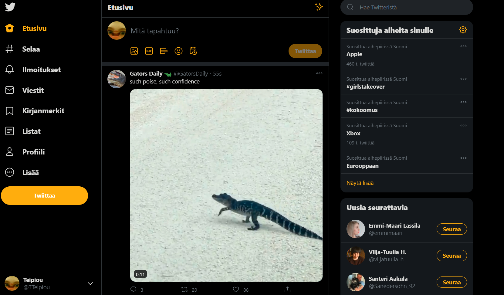

## Twitterin tarkoitus
Twitter on netissä tomiiva sosiaalisen median plavelu jossa käyttäjät pystyvät lähettämään ja lukemaan toistensa päivityksiä.

## Twitterin ohje
1. Käyttäjän voi tehdä helposti netissä
2. Etusivulla näkyy uusimmat julkaisut ihmisiltä joita seuraat
3. Etusivulla ylhäällä pystyy kirjottamaan "twiitin"

## Kuva Twitter feedistä

